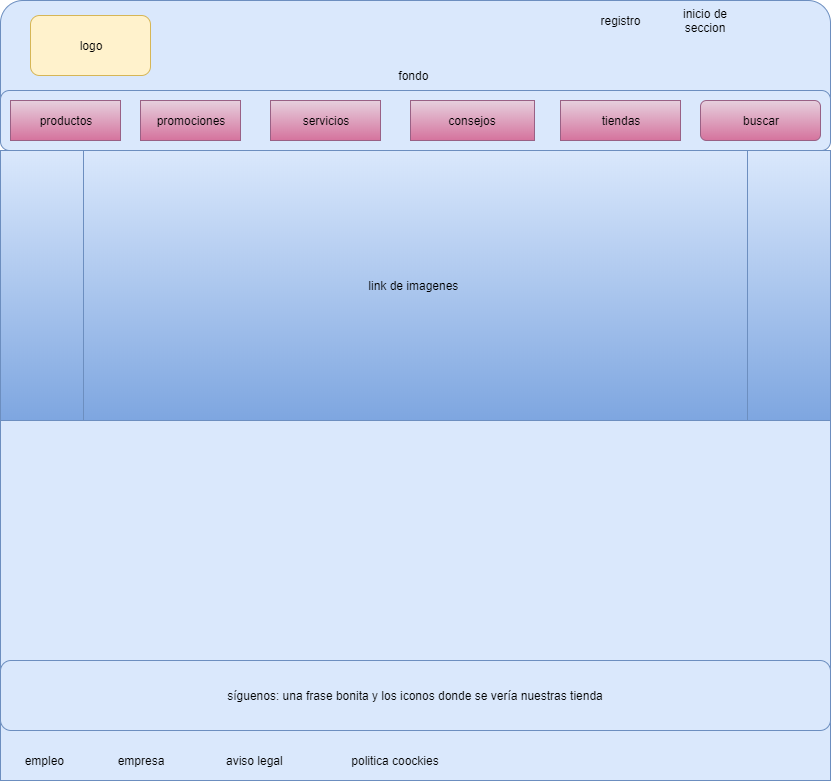
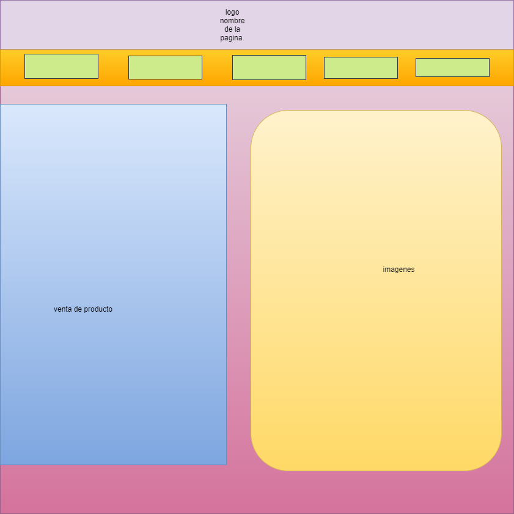
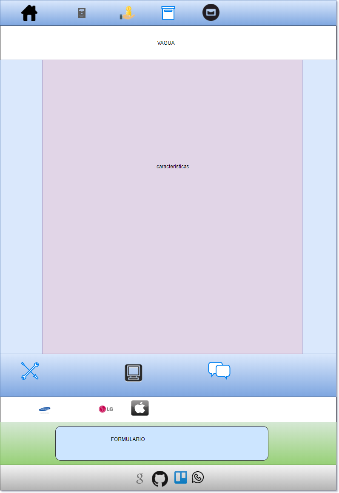

# VAGUA

## Descripcion del proyecto
En esta pagina vamos a presentar enl ultimo modelo de telefonia movil.

## perfiles usuarios

| Descripcion | enlces |observaciones|
|--------|--------|----|
|     Codepen   | [https://codepen.io/valle88/](https://codepen.io/valle88/)| mi perfil de codepen       |
|github | [https://github.com/valle88/](https://github.com/valle88/)| mi perfil github|
| proyecto| [https://valle88.github.io/vagua/](https://valle88.github.io/vagua/)| pagina principal proyecto|

## herramienta utilisada

- draw.io: [https://www.draw.io/](https://www.draw.io/)
- trello: [https://trello.com/](https://trello.com/)
- atom: [https://atom.io/](https://atom.io/)

## Fase 1: Boceto inicial de la pagina

## Fase 2: Boceto modificado de la pagina

## Fase 3: Boceto casi finalizado de la pagina

## librerias usadas
-tiny slider: [http://ganlanyuan.github.io/tiny-slider/tests/]
-menu spy: [https://leocs.me/menuspy]

## estilo de fuente
-shadows
-josefin
confortaa

## cosas que faltan por hacer
-responsive

